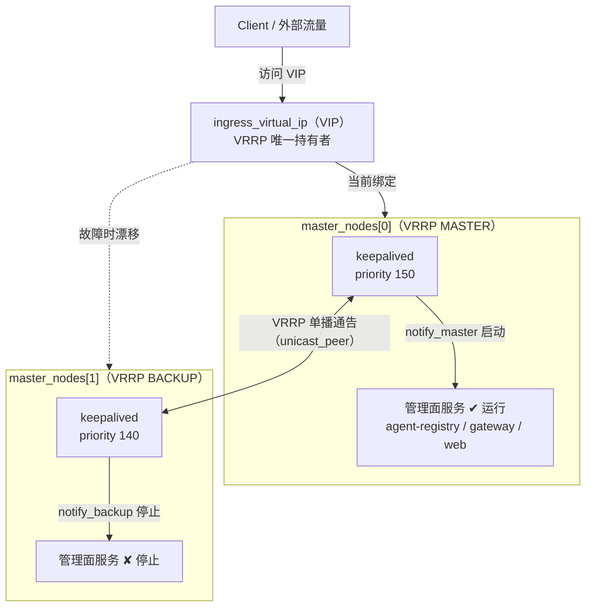
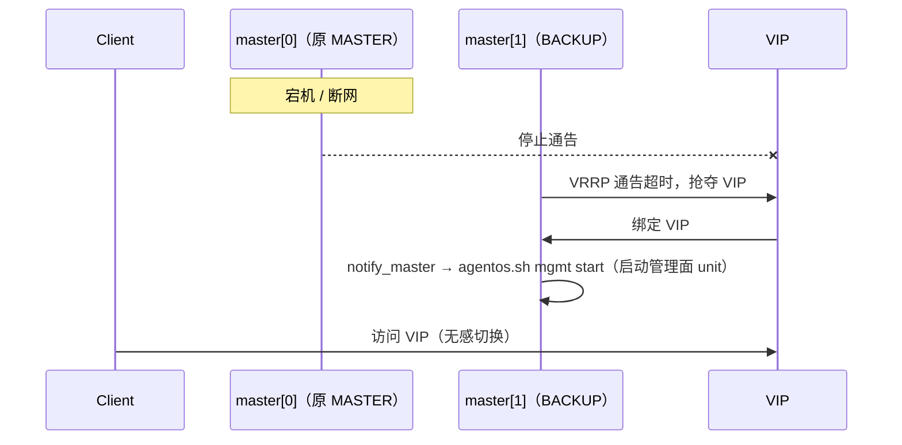
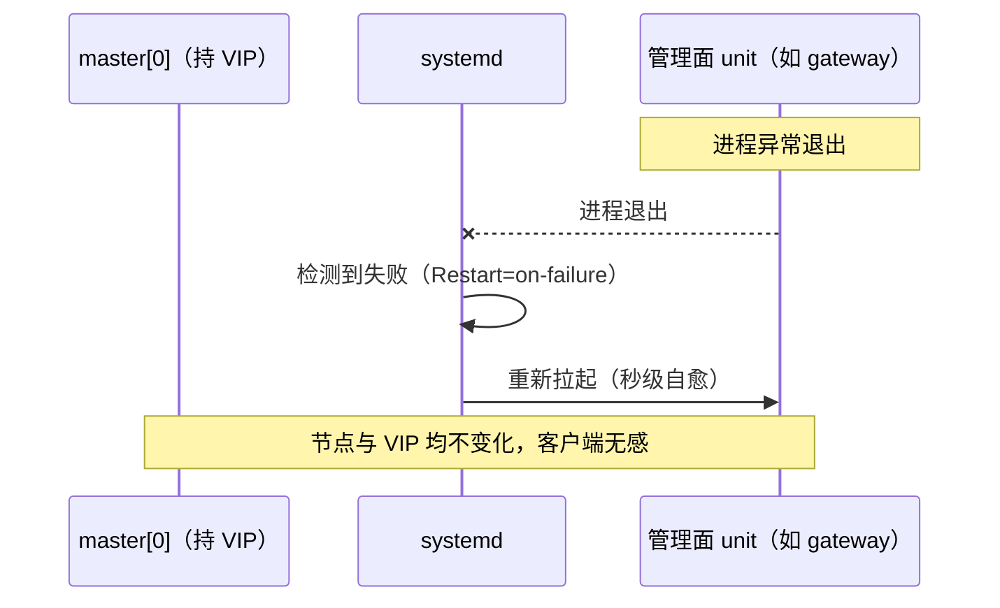
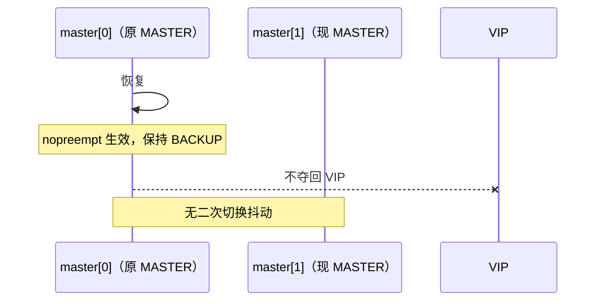

# AgentOS 多机部署可靠性设计文档

> 模块：`keepalived`（管理面高可用 / VIP 主备）
> 状态：已实现并接入 `agentos.sh` 可插拔架构

## 1. 背景与需求

AgentOS 多机部署时，管理面服务（**agent-registry**、**jiuwenswarm-gateway**、**jiuwenswarm-web**，下文统一简称"管理面服务"）在数个 master 节点之间部署。原实现依赖人工配置 VIP 绑定与手工启停，缺少**自动漂移**与**故障自愈**能力：VIP 由谁持有、管理面服务在该节点上是否应运行，均无机制保证，任一 master 节点宕机都会导致管理面整体不可用。

本设计引入 **keepalived（VRRP 协议）** 作为管理面的高可用底座，满足以下四项明确要求：

1. 管理面服务部署在 **master nodes** 上；
2. 基于 **keepalived 的 VIP** 对外提供服务；
3. master 节点上的服务为**主备部署**；
4. 通过 keepalived 的 `notify_master` / `notify_backup` / `notify_fault` 三个回调做服务的主备切换。

## 2. 目标与非目标

### 目标

- 管理面统一入口（VIP）在 master 节点间自动漂移，客户端无感。
- master 节点宕机/断网时，管理面自动切换到备用节点（节点级故障由 VRRP 通告驱动）。
- 无二次切换抖动（原 master 恢复后不夺回 VIP）。
- 复用 AgentOS 既有可插拔部署架构（`MODULES` + 钩子函数），零侵入调度引擎。
- 单机部署（单 master 或回环 VIP）零配置、自动跳过、向后兼容。

### 非目标

- 不改变既有管理面服务的对外协议与业务语义（仅接管其启停与 VIP 持有）。
- 不做 etcd 的高可用接管（etcd 本身由既有 `etcd.sh` / 多节点 raft 共识负责）。
- 不管理数据面/计算面节点的可靠性（yuanrong、moosefs 等模块独立负责）。
- 不做管理面服务的进程级健康探测：**服务存活由 systemd 自身监控并异常拉起**（`Restart` 策略），keepalived 只负责节点级故障（宕机/断网）经 VRRP 通告触发 VIP 漂移。

## 3. 架构总览



**要点**：

- **仅 master 节点**部署 keepalived 与管理面服务（由 `config.yaml` 的 `master_nodes` 判定）。
- **VIP 由 VRRP 竞争**：同一时刻仅有一个 master 节点持有一个 VIP。
- **管理面服务随 VIP 角色启停**：仅 VRRP MASTER（VIP 持有节点）运行服务，standby 不运行。
- **notify 回调是切换的驱动者**：状态机迁移时由 keepalived 调用统一的 notify 脚本。
- **服务存活交由 systemd**：管理面 unit 由 notify 随角色启停，其**进程存活与异常拉起由 systemd 自身负责**，keepalived 不重复做管理面健康探测。

## 4. 组件设计

### 4.1 `deploy/keepalived/module.sh`

AgentOS 可插拔模块，实现 5 个钩子函数，由 `agentos.sh` 的 `run_hooks` 调度。

| 钩子 | 行为 |
| --- | --- |
| `keepalived_install` | 启用判定 → 校验 keepalived 二进制 → 安装 notify 脚本（root:root + 700）→ 生成 `/etc/keepalived/keepalived.conf` |
| `keepalived_up` | `keepalived -t` 配置测试（失败仅告警）→ `systemctl enable --now keepalived` → 10 次重试确认 unit 就绪 |
| `keepalived_down` | 停 keepalived（释放 VIP 让 peer 接管） |
| `keepalived_uninstall` | 停服务 + `reset-failed` + 清理配置与脚本（保留二进制包） |
| `keepalived_status` | 输出 `keepalived\|keepalived.service\|<state>\|<detail>`，运行时探测 VIP 持有判定 VRRP 角色 |

**启用判定 `_ka_enabled()`**（同时决定 install/up/down 是否执行）：

```bash
# 多机 HA 才启用：master_nodes >= 2 且 VIP 非回环
vip != 127.*/空/0.0.0.0  且  master_nodes 数 >= 2
```

单机（单 master 或回环 VIP）时所有钩子自动跳过，向既有的单机部署链路完全透明。

**可配置常量**（见第 6 节环境变量）统一从环境变量读取并带默认值，避免硬编码。

### 4.2 生成的 `keepalived.conf`

`install` 时由 `_ka_generate_conf` 生成，核心配置：

```conf
global_defs {
    router_id agentos_<hostname>
    script_user root
    enable_script_security          # 要求脚本 root 属主 + 非 group/other 可写
}

vrrp_instance AGENTOS_INGRESS {
    state BACKUP                    # 统一 BACKUP + nopreempt
    nopreempt                       # 原 master 恢复后不抢回 VIP
    interface <探测到的本机 IP 网卡>
    virtual_router_id 51
    priority 150                    # master_nodes[0]=150, [1]=140, ...(-10/节点)
    advert_int 1
    authentication { auth_type PASS; auth_pass agentos51 }
    unicast_src_ip <本机 IP>
    unicast_peer { <其余 master 节点> }   # 单播组网，不依赖交换机组播
    virtual_ipaddress { <VIP> }
    notify_master "/etc/keepalived/agentos-notify.sh"
    notify_backup  "/etc/keepalived/agentos-notify.sh"
    notify_fault   "/etc/keepalived/agentos-notify.sh"
}
```

关键推导：

- **`priority`**：`150 - master_index * 10`。`master_index` 由 `config.py master-index` 返回本机在 `master_nodes` 中的序号（0 起）。第一个节点 priority 最高，初次由它成为 MASTER；之后 `nopreempt` 使其在恢复后不夺回。
- **`interface`**：`_ka_iface_of_local_ip` 通过 `ip -o -4 addr show` 探测本机 IP 所在网卡，失败回退路由表（`ip route get 1` 取 `dev` 字段）。
- **`unicast_peer`**：`master_nodes` 中去掉本机 IP 后的其余节点集合。
- **`state BACKUP` + `nopreempt`**：这是"非抢占"的关键。统一声明为 BACKUP，由 priority 决定谁是 MASTER；故障转移后即使原节点恢复，也保持 BACKUP，避免来回切换。

### 4.3 `keepalived-notify.sh`（切换驱动：VRRP 状态 → agentos 命令的薄适配层）

由 `notify_master` / `notify_backup` / `notify_fault` 三个回调统一指向。兼容 keepalived 1.x（`TYPE`）与 2.x（`STATE`）环境变量，也支持位置参数。

**分层原则**：本脚本**不感知任何具体管理面 unit**。注册单元清单（registry/gateway/web）由 `agentos.sh` 顶部的 `MGMT_UNITS` 数组统一维护，本脚本只调用可插拔命令 `agentos.sh mgmt start|stop`。这样管理面服务的增删，只需改 `agentos.sh` 一处；notify 成为无业务决策的 VRRP 状态翻译层。

**状态机（幂等、可重入）**：

| TYPE | 语义 | 动作 |
| --- | --- | --- |
| `MASTER` | 本机夺得 VIP，成为管理面主节点 | `agentos.sh mgmt start` |
| `BACKUP` | 本机失去 VIP，成为备用 | `agentos.sh mgmt stop` |
| `FAULT` | 实例故障，失却 VIP 且不再参与抢占 | 停止管理面 unit |

**设计要点**：

- **薄适配**：只调用 `agentos.sh mgmt start/stop`，unit 清单在 `agentos.sh` 的 `MGMT_UNITS` 中感知；`agentos.sh` 内部再 `systemctl enable --now` / `disable --now` 遍历该清单。
- **幂等**：重复回调同一状态时，`enable --now`/`disable --now` 本身幂等，不会重复生效。
- **路径注入**：install 时由 `module.sh` 把 `agentos.sh` 的绝对路径（`${SCRIPT_DIR}/agentos.sh`，即执行 install 时 agentos.sh 实际所在的 deploy/ 目录）替换进脚本占位符 `@AGENTOS_SH@`，不假定固定安装位置；deploy 目录迁移后重跑 install 即可刷新。
- **`exit 0`**：始终非零不返回，避免阻塞 keepalived 主线程；命令失败仅记日志。
- **日志**：写入 `/var/log/agentos/keepalived-notify.log`。
- **与 ExecStartPre 协同**：还保留全部管理面 unit 的 `check-ingress-master.sh` 作为二道防线（见第 5 节）。

### 4.4 管理面服务存活：由 systemd 监控并异常拉起

keepalived **不做管理面服务的健康探测**（无 `vrrp_script` / `track_script`），职责边界如下：

| 故障层级 | 负责方 | 机制 |
| --- | --- | --- |
| 服务进程异常退出/挂死 | **systemd** | unit 的 `Restart=on-failure`（或等效策略）自动拉起，原地自愈，不触发 VIP 漂移 |
| 节点宕机 / 断网 / keepalived 进程消失 | **keepalived（VRRP）** | 通告超时，backup 抢夺 VIP，`notify_master` 在对端拉起管理面服务 |

**这样划分的理由**：

- 管理面 unit 均由 systemd 托管，服务级故障 systemd 自愈的代价（原地重启，秒级）远小于 VIP 漂移（主备切换 + 双方启停服务）；
- keepalived 若重复探测服务健康并扣减 priority，会与 systemd 的重启窗口竞争，服务重启瞬间可能误触发不必要的 VIP 漂移；
- 职责单一：keepalived 只回答"这个节点还活着吗"，systemd 只回答"这个服务还活着吗"。

### 4.5 `scripts/config.py` 新增子命令

新增两个子命令供模块推导角色：

| 子命令 | 输出 |
| --- | --- |
| `master-index` | 本机在 `master_nodes` 中的序号（0 起），用于 priority 推导；本机不在列表则非零退出 |
| `master-nodes` | 全部 master 节点 IP（空格分隔），用于推导 `unicast_peer` |

## 5. 二道防线（fail-closed）

keepalived notify 负责**正向驱动**（角色迁移时启/停管理面 unit），但存在一种竞态：unit 已被 `enable`，而本机实际未持有 VIP（例如 notify 回调与 VIP 生效的时序差异）。

因此保留并强化**全部管理面 unit** 的 `ExecStartPre=/usr/local/bin/agentos-check-ingress-master`（agent-registry / jiuwenswarm-gateway / jiuwenswarm-web）：

- **校验本机是否真持有 VIP**，未持有则拒绝启动（fail-closed）。
- 即使 notify 误启动 unit，服务本身也会因 VIP 检查而退出，形成**双保险**。

两层分工：
- **notify**：负责"该不该跑"的角色迁移主逻辑；
- **ExecStartPre**：负责"本机此刻是否真持有 VIP"的事实校验。

## 6. 配置项与环境变量

### 6.1 集群拓扑 `config.yaml`

```yaml
cluster:
  master_nodes:            # 多机 HA 时填 2 个（主备）节点 IP
    - "192.168.1.10"       # master_nodes[0]：默认 MASTER，priority 最高
    - "192.168.1.11"
  ingress_virtual_ip: "192.168.1.100"   # VIP，由 keepalived VRRP 竞争
```

> master_nodes 数 >= 2 且 VIP 为非回环地址时，keepalived 模块自动启用；单机/回环 VIP 自动跳过。

### 6.2 keepalived 环境变量

| 变量 | 说明 | 默认值 |
| --- | --- | --- |
| `KEEPALIVED_VRID` | VRRP virtual_router_id（同网段多套集群需错开） | `51` |
| `KEEPALIVED_ADVERT_INT` | VRRP 通告间隔（秒） | `1` |
| `KEEPALIVED_AUTH_PASS` | VRRP 认证密码 | `agentos51` |

### 6.3 前置要求

- master 节点需预装 keepalived：`yum install -y keepalived`。
- keepalived 运行需要 systemd 与 root 权限。
- 管理面 unit 需配置 systemd 重启策略（如 `Restart=on-failure`），服务异常由 systemd 自动拉起。
- `enable_script_security` 要求 notify 脚本 `root:root` 属主 + 非 group/other 可写（`chmod 700` 已满足）。

## 7. 主备切换流程

### 7.1 初次启动

1. 各 master 节点 `install` 生成 `keepalived.conf`（priority 按索引递减），`up` 启动 keepalived。
2. VRRP 依据 priority 选出 MASTER（默认 `master_nodes[0]`）。
3. MASTER 持有 VIP，触发 `notify_master` → `agentos.sh mgmt start` 启动管理面 unit。
4. BACKUP 不持有 VIP，触发 `notify_backup` → `agentos.sh mgmt stop`，无管理面 unit 在跑。

### 7.2 Master 节点宕机（正常故障转移）



### 7.3 管理面服务挂死（systemd 自愈，不漂移 VIP）

服务级故障由 systemd 原地拉起，**不会**触发 VIP 漂移（避免无谓的主备切换）。



### 7.4 原 Master 恢复



## 8. 故障场景覆盖矩阵

| 故障场景 | 检测方 | 行为 | 恢复后 |
| --- | --- | --- | --- |
| master 节点宕机 / 断网 | VRRP 通告超时 | backup 升 MASTER，`notify_master` 拉服务 | `nopreempt` 保持 BACKUP |
| master 管理面服务异常退出/挂死 | systemd | `Restart` 策略原地拉起，秒级自愈，VIP 不漂移 | — |
| keepalived 进程故障 | VRRP 通告停止 | 同宕机，backup 接管 | 同宕机 |
| 非 master 节点误启动管理面 | `ExecStartPre` VIP 校验 | fail-closed 拒绝启动 | — |

## 9. 与 AgentOS 部署架构的集成

- **模块注册**：加入 `MODULES` 数组末位（`"moosefs" "jiuwenbox" "yuanrong" "agent-gateway" "jiuwenswarm" "keepalived"`）。
  - `up` 放最后：此时管理面 unit 已由前面的模块生成，VRRP notify 才能接管其启停。
  - `down` 最先停：逆序执行时 keepalived 最先停，释放 VIP 让 peer 接管，之后再逆序停其余组件。
- **钩子调度**：复用 `run_hooks` 引擎，未修改 `agentos.sh` 的任何调度逻辑。
- **角色推导**：完全依赖既有 `config.py`（新增 `master-index`/`master-nodes` 两个子命令），无新增配置入口。

## 10. 验证方法

```bash
# 语法校验
bash -n deploy/keepalived/module.sh
bash -n deploy/keepalived/keepalived-notify.sh

# 子命令注册
python deploy/scripts/config.py --help   # 应含 master-index / master-nodes

# 配置合法性
keepalived -t -f /etc/keepalived/keepalived.conf
```

**运行时验证（多机 2 节点）**：

1. 两节点启动后，`ip addr show` 确认仅一节点持有 VIP；
2. 用 `kill -9` 杀掉 VIP 持有节点上的管理面进程，确认 systemd 秒级拉起（`Restart` 策略）、VIP 不漂移（`ip addr show` 仍在本机）；
3. 停掉 master 节点，确认 VIP 被对端接管、客户端经 VIP 可访问；
4. 重启原 master，确认 `nopreempt` 生效、不夺回 VIP。

## 11. 风险与边界

- **同网段二套集群**：需通过 `KEEPALIVED_VRID` 与 `KEEPALIVED_AUTH_PASS` 区分，避免 VRRP 实例互相干扰。
- **服务自愈依赖 systemd**：管理面 unit 需由 systemd 托管并配置 `Restart` 策略（agent-gateway 默认 systemd）；无 systemd 的 nohup 回退场景下服务异常无人拉起，仅剩 VRRP 节点级故障检测。
- **`unicast_peer` 单向组网**：peer 列表由 `master_nodes` 静态推导，节点 IP 变动需同步 `config.yaml` 并重新 `install`。
- **`enable_script_security`**：脚本权限必须满足 root 属主 + 非 group/other 可写，否则 keepalived 拒绝执行脚本（安装时已 `chmod 700` 保证）。
